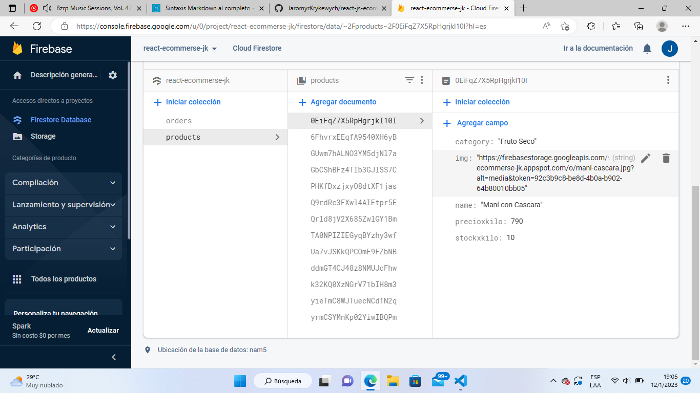
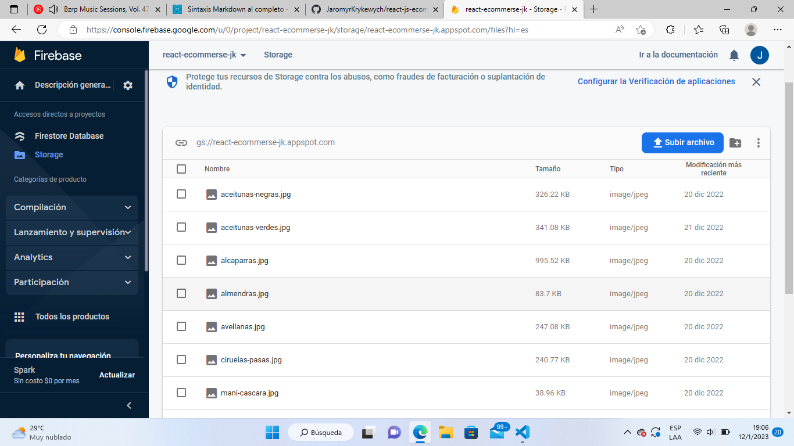

# E-commerse - Tienda de Nutrición

El siguiente es un proyecto e-commerse básado en una tienda de alimentos saludables de venta por peso (100gr x unidad) realizada con la libreria de: [React JS](https://es.reactjs.org/). y alojada a través de Git Hub Pages con el siguiente link: [Tienda de Nutrición](https://jaromyrkrykewych.github.io/react-js-ecommerce-krykewych/).

## Dependencias

En este proyecto se utilizaron las siguientes dependencias de trabajo:

- [React Router Dom](https://reactrouter.com/en/main): Dependencia usada para el manejo de rutas y navegación dentro de la aplicación web
- [React Spinners](https://www.npmjs.com/package/react-spinners): Dependencia que ofrece componentes de carga para implementar cada vez que hacemos una llamada a un servidor externo mediante una promesa.
- [Unicons Iconscout](https://iconscout.com/unicons): Libreria de iconos que se pueden importar como componentes.
- [Firebase](https://firebase.google.com/?hl=es): Plataforma que cuenta con Base de datos para almacenar información

~~~
  "dependencies": {
    "@iconscout/react-unicons": "^1.1.6",
    "firebase": "^9.15.0",
    "react": "^18.2.0",
    "react-dom": "^18.2.0",
    "react-router-dom": "^6.4.4",
    "react-spinners": "^0.13.7",
  },
~~~

## Dependencias de desarrollo

- [GitHub Pages](https://pages.github.com/): Como hemos comentado alojamos la aplicación web con GitHub Pages instalando la dependencia: 
 
~~~
  "devDependencies": {
    "gh-pages": "^4.0.0"
  }
~~~

Agregando nuestro repositorio de GitHub en el package.json:

~~~
 "homepage": "https://JaromyrKrykewych.github.io/react-js-ecommerce-krykewych" 
~~~

Y agregando los siguientes scripts en el documento:

~~~
  "predeploy": "npm run build",
  "deploy": "gh-pages -d build",
~~~

## Estructura de nuestra aplicación web

La composición de nuestra app parte con la implementación de *React Router Dom* para manejar las rutas y el componente *<NavBar />* para la navegación entre rutas, además de un componente *Provider* donde usamos *UseContext* de react para poder manejar información a lo largo del arbol de componentes sin necesidad de props. 

~~~
  <BrowserRouter className="App"> {/* Componente contenedor de todo el entorno donde estarán nuestras rutas */}
    <CartProvider> {/* Context: Componente contenedor para manejar datos a lo largo de la aplicación  */}
      <NavBar /> {/* Navegación */}
      <Routes> {/* Rutas */}
        {/* Contenido de la App */}
      </Routes>
    </CartProvider>
  </BrowserRouter>
~~~

Procedemos a configurar las rutas y componentes de ruta donde mostraremos nuestra información 

~~~
  <Route path='/carrito' element={<Cart />} /> {/* Ruta con el Carrito de Compras y el Checkout del cliente */}
  <Route path='/producto/:id' element={<ProductById />} /> {/* Ruta del detalle del producto */}
  <Route path='/productos/:category' element={<Products />} /> {/* Ruta para ver una categoria de productos*/}
  <Route path='/productos' element={<Products />} /> {/* Ruta donde se ven todos los productos */}
  <Route path='/' element={<Home />} /> {/* Ruta principal con la bienvenida y productos */}
  <Route path='*' element={<Navigate to='/' replace />}/> {/* Redirección a Home si el path no existe */}
~~~

Estos componentes de Ruta tendrán Componentes Contenedores donde manejaremos la lógica de nuestros componentes y haremos las llamadas necesarias para la obtención de datos, algunos de estos son:

* ItemListContainer
* ItemDetailContainer
* Cart
* Checkout

Luego tenemos los Componentes Presentacionales que contiene la información de los elementos que queremos mostrar, algunos de estos son:

* ItemList
* Item
* CartWidget
* CartItems
  
## Base de Datos

Los datos fueron manejados a través [Firebase](https://firebase.google.com/?hl=es) donde alojamos la información de nuestros productos y que luego llamamos desde los Componentes Contenedores

- Firestore Database
  

- Storage

